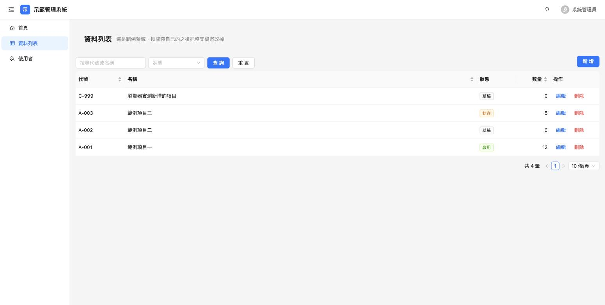

# smart-scaffold

一支開新專案的腳手架工具。逐步問答問完該問的，然後生成骨架、裝依賴、`git init`
並產生第一顆繁體中文 commit。

## 為什麼要有它

現有專案都是「開工之後才看到生出來的結構，然後妥協」，所以每個專案長得都不一樣。
把結構決定的時機提前到**什麼都還沒寫的時候**，改的成本是零。

## 安裝

執行期**零第三方依賴**，只用標準庫，所以在任何一台裝好 Python 3.12 的機器上都跑得動。

```bash
git clone <這個 repo> && cd smart-scaffold
uv sync --extra dev
```

不想裝也可以直接跑：

```bash
python3 -m smart_scaffold py
```

## 怎麼用

兩個 preset：

| preset | 生出什麼 |
|---|---|
| `py` | Python 專案：uv + `src/` 套件分層 + `scripts/` + `config/` |
| `app` | 全端專案：FastAPI + SQLAlchemy 2.0 (async) + Vue 3 + Ant Design Vue |

互動模式——問完每一題就開始生：

```bash
uv run smart-scaffold py
uv run smart-scaffold app
```

旗標模式——全部給齊就完全不用互動（CI 或腳本裡用這個）：

```bash
uv run smart-scaffold py \
  --name demo_tool \
  --path ~/Desktop/@SideProjects/demo_tool \
  --port 8123
```

`--help` 會列出每一題的提示文字與預設值：

```bash
uv run smart-scaffold py --help
```

常用旗標：

| 旗標 | 作用 |
|---|---|
| `--yes` / `-y` | 不互動，沒給的項目一律用預設值 |
| `--no-install` | 跳過 `uv sync` |
| `--no-git` | 跳過 `git init` 與第一顆 commit |

生成完會做三件事：裝依賴 → `git init -b main` → 第一顆 commit。
依賴安裝的步驟由 preset 決定（`app` 會分別裝後端的 `uv sync` 與前端的
`npm install`）。**任何一步失敗都不會中止**，只會在總結裡叫你自己補跑。

`app` preset 生出來的東西：登入頁、側邊欄 + 頂欄的後台殼、深色模式、
可重用的 `ProTable`（接後端統一的 `Page[T]` 分頁格式）、JWT + refresh token
輪替、統一錯誤格式、軟刪除。資料庫預設 sqlite（開箱即跑），選 postgres 會
附上 `docker-compose.yml`。



埠號是算出來的：從 8000 往後找第一個沒被佔用的埠，判定來源是實際 bind 測試加上
`docker ps` 已發布的埠。機器上沒有 docker 只是少一個來源，不會出錯。

## 模板放在哪

```
src/smart_scaffold/templates/
├── py/     # Python 專案：uv + src/ 套件分層 + scripts/ + config/
└── app/    # 全端：FastAPI + SQLAlchemy 2.0 + Vue3 + Ant Design Vue
```

模板裡的佔位符是 `{{var}}`，**大括號裡不能有空白**，而且**檔名與資料夾名也會
被替換**（例：`src/{{name}}/__init__.py`）。

兩條容易踩到的規則：

* 刻意不用 `$var`，因為模板裡有 Makefile 與 shell，`$(MAKE)` 和 `$$` 不能被動到。
* 「不能有空白」是為了跟 Vue 共存——Vue 的插值長得一模一樣。`{{var}}` 是佔位符，
  `{{ expr }}`（有空白）原樣留給 Vue。prettier 會自動把 Vue 那邊排成有空白的樣子，
  所以實務上不用特別注意。

## 怎麼新增一個 preset

1. 在 `src/smart_scaffold/templates/<key>/` 放模板檔案。
2. 在 `src/smart_scaffold/presets.py` 的 `PRESETS` 加一筆 `Preset(...)`。

就這樣——CLI 子命令、旗標、`--help` 都會自己長出來。

**新增一個問題**同樣只改 `presets.py` 一處：在問題清單裡加一個 `Question`，
旗標與 `--help` 自動跟上。在別的地方再寫一份清單就是 bug。

## 開發

```bash
uv run pytest         # 測試
uv run ruff check .   # lint
```

模板資料夾被 ruff 排除（裡面不是合法 Python），改模板後靠「實際生一個專案出來」驗證。

## 未完成事項

- 只有終端機問答，沒有 TUI／GUI。問題定義與 renderer 已經分開，要加的時候只換
  `ask_all()` 的 `reader` / `writer`。
- `app` preset 的前端用 `app.use(Antd)` 整包註冊 antd，沒有做 tree-shaking。
  要瘦身的話換成 `unplugin-vue-components`，但記得 `message` / `notification`
  這類命令式 API 還是要自己 import。
- `app` preset 沒有 Dockerfile／部署設定，只有本機開發用的 `docker-compose.yml`
  （而且只在選 postgres 時才需要）。
